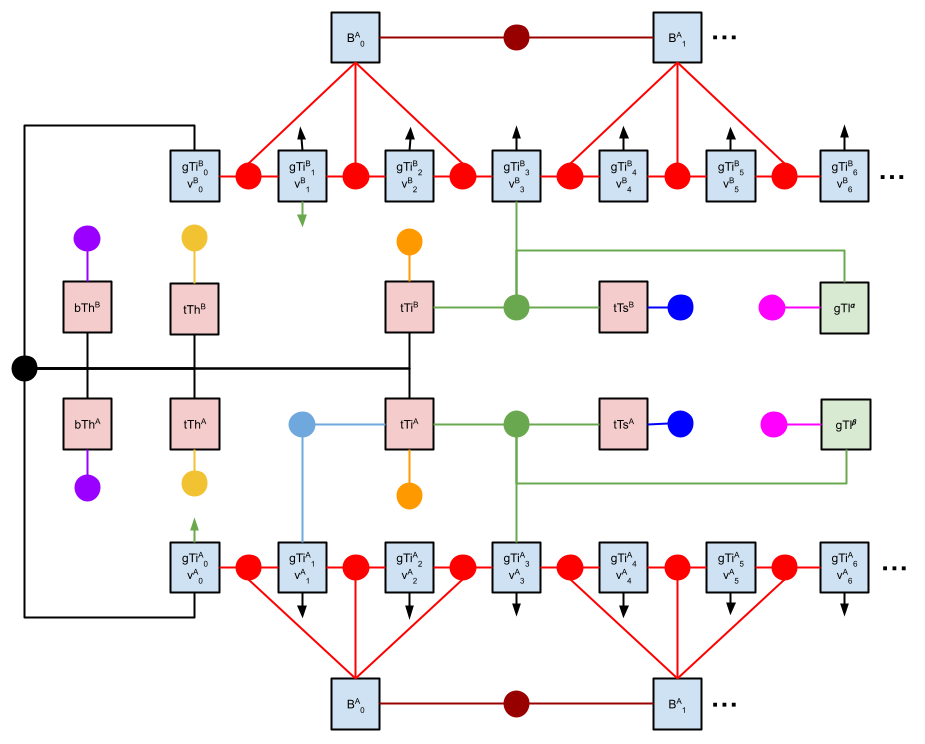

# libsurvive_ros2
**A ROS2 driver for Steam Tracking 2.0**

[](https://app.circleci.com/pipelines/github/asymingt/libsurvive_ros2)

This is a lightweight ROS2 wrapper around the [libsurvive](https://github.com/cntools/libsurvive) project, which provides a set of drivers for 6DoF rigid body tracking using SteamVR 2.0 hardware. It also listens for inertial, button, configuration and device connection events, and forwards these to various topics.

This hardware is particularly useful to robotics projects, because it provides a cost effective method of obtaining ground truth with a positional accuracy typically in the sub-centimeter, sub-degree range. The final accuracy of course depends on the tracking volume, lighthouse number and placement and level of occlusion, as well as calibration quality.

The driver in this repo is largely based on the ROS1 driver [here](https://github.com/cntools/libsurvive/tree/master/tools/ros_publisher). It has been migrated to ROS2, and refactored slightly -- we use a thread to manage the blocking interaction with libsurvive, so that it doesn't lock the ROS2 callback queue and prevent messages from propagating correctly.

When you build this code `cmake` will checkout and build the latest stable release of `libsurvive` and link against this library for you. This is to avoid having to discover it through pkg-config, and ensures that you are using a version that has been tested and is known to work well with ROS2.

Progress:

- [x] code ported
- [x] documentation added
- [x] foxglove example
- [x] fix timestamp errors
- [x] test imu callback
- [x] test connect callback
- [x] fix button callback (only works wirelessly via watchman, not with USB)
- [x] add linting checks
- [x] add unit tests
- [x] fix composable node (not a functional blocker right now)
- [x] add circle ci pipeline for ROS2 rolling: arm64, amd64 
- [x] add circle ci pipeline for ROS2 foxy: arm64, amd64 
- [x] add circle ci pipeline for ROS2 galactic: arm64, amd64 
- [x] add circle ci pipeline for ROS2 humble: arm64, amd64 
- [x] add circle ci pipeline for ROS2 irwin: arm64, amd64 
- [x] add configuration stitcher
- [ ] add rigid body tracker
- [ ] add mergify integration (nice to have)
- [ ] add dependebot integration (nice to have)
- [ ] convert to lifecycle node (nice to have)

# Installation instructions

This has only been tested on Ubuntu 22.04 and ROS Humble, although its fairly likely to work correctly with other distributions too. Pull requests are welcome if it does not!

Before you do anything, you will need to install these udev rules and reload the subsystem.

```
sudo curl -fsSL https://raw.githubusercontent.com/cntools/libsurvive/master/useful_files/81-vive.rules \
    -o /etc/udev/rules.d/81-vive.rules
sudo udevadm control --reload-rules && udevadm trigger
```

You can now choose to build the driver natively or in a container. The benefit of launching it within a container is that it won't interfere with any pre-existing ROS installation on your machine. However, you will need docker-ce and the compose plugin for things to work.

## Containerized build and test (easiest and recommended)

Install docker and docker-compose: https://docs.docker.com/engine/install/ubuntu/

```sh
$ docker compose build
$ docker compose run libsurvive_ros2 colcon test
```

This will checkout a lightweight ROS2 rolling container, augment it with a few system dependencies, checkout and build the code and drop you into a bash shell as user `ubuntu` at the home directory `~/ros2_ws/src`. If you'd rather build and test for ROS2 Rolling on arm64, as an example, you'd do this:

```sh
$ docker compose build --build-arg ARCH=arm64 --build-arg ROS_DISTRO=rolling
$ docker compose run libsurvive_ros2 colcon test  # optional, to test the package
```

Note that if you are building on a different architecture than the host you must follow the docker/QEMU installation instructions here before running the command above. Here is a link to a document outlining how this is done: https://docs.nvidia.com/datacenter/cloud-native/playground/x-arch.html

## Native build and test (not recommended)

You'll need ROS2 installed on Ubuntu 22.04: https://docs.ros.org/en/humble/Installation.html. After installation please refer to the [Dockerfile](./Dockerfile) to see what commands must be run to get the system working correctly.

# Running the code

Before running this driver, please make sure that you are only using Steam Tracking 2.0 lighthouses and trackers, and that each Gen 2 lighthouse has been assigned a unique ID. The best way to do this is to use the [crazyflie python client](https://www.bitcraze.io/documentation/tutorials/getting-started-with-lighthouse). Please refer to the section entitled `Configure the base stations channel (mode)` in their getting-started guide. From this point on it wil be assumed that the "mode" or "channel" of each lighthouse has been set correctly. Failing to do this will cause problems. 

To run the driver in a containerized context do the following:

```sh
$ docker compose up
```

Alternatively, to run the driver on native installations run the following:

```sh
$ ros2 run libsurvive_ros2 libsurvive_ros2.launch.py web_bridge:=true
```

There are three launch arguments to `libsurvive_ros2.launch.py` to help get up and running:

- `namespace = string (default: 'libsurvive')` : This is the namespace on which to add the extra topics for sensor data.
- `record = boolean (default: false)` : Start a `ros2 bag record` to save `/tf` and `/tf_static` topics to a ros bag in the ROS2 log directory for the current launch ID as `libsurvive.bag`.
- `rosbridge = boolean (default: false)` : Starts a `rosbridge_server` and `rosapi`, which offers data over a websocket by default at port 9090, which allows you to stream directly into the [foxglove.dev](https://foxglove.dev) robotics visualization tool.
- `composable = boolean (default: false)`: For advanced users only -- it shows how to load the component-based version of the code to get zero-copy IPC between it and other composable nodes. 

# Example visualization in Foxglove Studio

After launch the stack (with `rosbridge:=true`), navigate to [this Foxglove link](https://studio.foxglove.dev/?ds=rosbridge-websocket&ds.url=ws%3A%2F%2Flocalhost%3A9090
) and you should see the data streaming:


Now move the tracker around and you should see its corresponding transform move around inn the user interface.

# Additional tooling

## Lighthouse calibration file stitching

Libsurvive is capapable

Each tracker can only receive data from up to four lighthouses. For this reason, in the case where you want to cover a wider region, you would choose a lighthouse

So, this makes calibration tricky, because some lighthouses just wont be visible to a single tracker. A common way

```sh
# move the tracker to a new subset of anchors

docker compose run ros2 launch libsurvive_ros2 libsurvive_ros2.launch.py \
  recalibrate:=true driver_config_out:=/data/config1.json

# move the tracker to a new subset of anchors

docker compose run ros2 launch libsurvive_ros2 libsurvive_ros2.launch.py \
  recalibrate:=true driver_config_out:=/data/config2.json

# move the tracker to a new subset of anchors

docker compose run ros2 launch libsurvive_ros2 libsurvive_ros2.launch.py \
  recalibrate:=true driver_config_out:=/data/config3.json

...

docker compose run ros2 launch libsurvive_ros2 libsurvive_ros2.launch.py \
  recalibrate:=true driver_config_out:=/data/configN.json

# stitch all of them together

docker compose run ros2 run libsurvive_ros2 config_merger -i \
  -i /data/config1.json ... /data/configN.json \
  -r src/libsurvive_ros2/test/example_registration.yaml \
  -o /data/config_merged.json

# then use the final stitched config

docker compose run ros2 launch libsurvive_ros2 libsurvive_ros2.launch.py \
  recalibrate:=false driver_config_in:=/data/config_merged.json
```

## Rigid body poser

### Background terminology

This driver includes its own "poser" which in stead of tracking a single device in isolation, treats devices attached to a rigid body as sources from which to draw measurements. This allows a large body to be tracked by many devices, and this redundancy should with stability.

We'll adopt this frame nomenclature shorthand:

```
g : the global frame (the parent frame which tracking is relative to)
l : the lighthouse frame
t : the tracker "tracking" frame (virtual point within the tracker)
s : the tracker "sensor" frame (midpoint of a sensor)
h : the tracker "head" frame (the bolt on the back of the tracker)
i : the tracker "imu" frame (the IMU origin)
b : the origin of a rigid body to which a tracker is attached
```

The variable `aTb` is the transform that moves a point `a_x` from being expressed in frame `a` to a point `b_x`, expressed in frame `.`. So, `b_x = aTb * b_a`. This is great because you can fact check long transforms for correctness by looking at adjacent variables. As an example, let's assume that a tracking sensor is located at some point `t_p` expressed in the tacking frame. To move it into the lighthouse frame, where it's angle can be predicted, we just do this chain of frame transforms: `l_p = lTg * gTt * t_p`.

### Algorithmic approach

Our tracking problem can be modeled with a nonlinear factor graph. In this paradigm nodes represent quantities we want to estimate, and factors are nonlinear constraints that limit the relative or absolute values that nodes can assume.

The nice thing about this representation is that probability is handled well, and measurements are all weighted to produce the best estimate possible. We also have a great library, GTSAM, which takes care of some the harder parts of probability handling and sensor fusion, which would be very tricky to write correctly ourselves.

GTSAM has many optimizer, but the one we'll be using is iSAM2. A distinct advantage with this solver is that we can perform updates incrementally -- the whole graph need not be solved every time over-and-over again. In fact, iSAM2 is clever enough to understand local cliques of constraints and perform isolated updates to limit compute.

Although it is possible to add custom factor types in GTSAM, it involves deriving a Jacobian for your factor, which is not straightforward to do correctly. For this reason, we're going to shoehorn our problem into a format that couples nicely with this framework. To do th

### Model 1 (how not to do it)

Here's the naive way to solve the problem, where we treat every IMU measurement as a constraint on the evolution of the IMU frame pose. The major issue with this representation is that the graph size scales as a function of the number of IMUs (trackers) and not the number of rigid bodies. Moreover, it requires a CustomFactor to project the `gTi[t]` pose into the tracking frame in order to add an angle constraint.



#### Variables

We'll estimate the following quantities for each lighthouse `m`, tracker `j` with `k` sensors over `t` time steps, a subset `t'` of which are used to model IMU bias:

```
(V0) gTi[j,t] : the pose of the imu in the global frame for all times t.
(V1) B[t']    : the imu accel and gyro bias for a subset of times t'.
(V2) tTs[j,k] : the sensor to tracking frame transform for each sensor.
(V3) tTh[j]   : the bolt-head to tracking frame transform
(V4) tTi[j]   : the IMU frame to tracking frame transform
(V5) bTh[j]   : the bolt-head to body origin frame transform
(V6) gTl[m]   : the lighthouse -> global frame transform for all times t.
```

#### Factors

The evolution of the pose in the IMU frame is captured by an IMU factor along with a bias drift factor. GTSAM uses a pre-integration approach when solving in order to prevent the 250 measurements being inserted every second from causing the graph size to become unsolvable in the time budget. 

```
(F0) ImuFactor(gTi[j,t-1], V[j,t-1], gTi[j,t], V[j,t], B[j,t'])       [red]
(F1) BetweenFactor(B[j,t'], B[j,t''])                               [brown]
```

There are a couple of transforms which have initial values calibrated and written into the tracker firmware. They are the following:

```
(F2) PriorFactor(tTh[j])                                           [yellow]
(F3) PriorFactor(tTi[j])                                           [orange]
(F4) PriorFactor(tTs[j])                                        [dark blue]
```

Libsurvive comes up with its own pose solution using MPFIT, which provides us with priors on the static poses of the lighthouses and the time-varying pose of a trackers "tracking frame":

```
(F5) PriorFactor(gTl[m])                                             [pink]
(F6) CustomFactor(gTt[j],tTi[j,t])                             [light blue]
```

We perform our own extrinsic calibration procedure to determine the pose of the tracker's head frame in the rigid body frame.

```
(F7) PriorFactor(bTh[j])                                           [purple]
```

The light measurement essentially applies a constraint on the arctangent of the 2D vector pointing towards the sensor position projected into the lighthouse frame. This requires a custom factor and a target axis (X or Y).

```
(F8) CustomFactor(gTl[m], gTi[j,t], tTi[j], tTs[j,k], axis)         [green]
```

The rigid body constraint enforces the fact there is consistency between a pair of tracker poses at any time stamp. In order words that when their pose gTt[j,t] is used to resolve the bTg transform, they match. In other words for two sensors A and B: `gTt[A,t] x tTh[A] x (bTh[A])^-1 == gTt[B,t] x tTh[B] x (bTh[B])^-1`.

This yields the following factor for all:

```
(F9) CustomFactor(gTt[A,t], tTh[A], bTh[A], gTt[B,t], tTh[B], bTh[B]) [red]
```

### Model 2 (implemented in this code)


# Frequently asked questions

- **I don't see any data streaming** Examine the console log. If you see a LIBUSB error, chances are high that you either haven't installed the udev rules, or you haven't mounted the /dev/bus/usb volume correctly into the docker container.

- **How do I configure this for my specific tracker ID?** There's no need -- the libsurvive driver will enumerate all devices, query their ID and publish this ID as the transform name using the TF2 standard topic `/tf`. Lighthouse positions change less frequently, and so they are published at a lowe rate on `/tf_static`.

- **The ligthhouse locations are not where I'd expect them to be** -- The calibration phase of libsurvive works out the relative location of the lighthouses. It has no idea of their orientation with respect to the room. To fix this, you will need to write your own static transform broadcaster to provide the relationship between your world frame and the `libsurvive_world` frame.

- **In need to send extra arguments to the driver** -- Have a look at the `libsurvive_ros2.launch.py` file, and particularly at the `parameters` variable. You should probably be writing your own launch file, and you can include custom modifications for your specific tracking setup by changing the parameters you pass to the driver.


